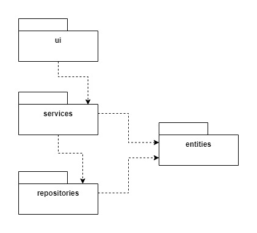
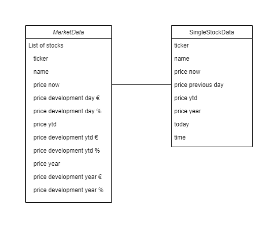
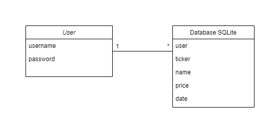
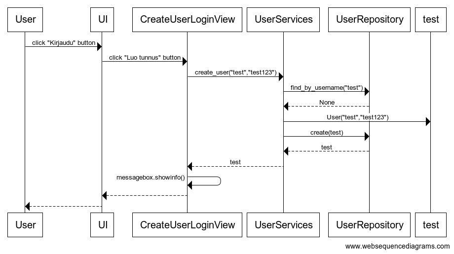
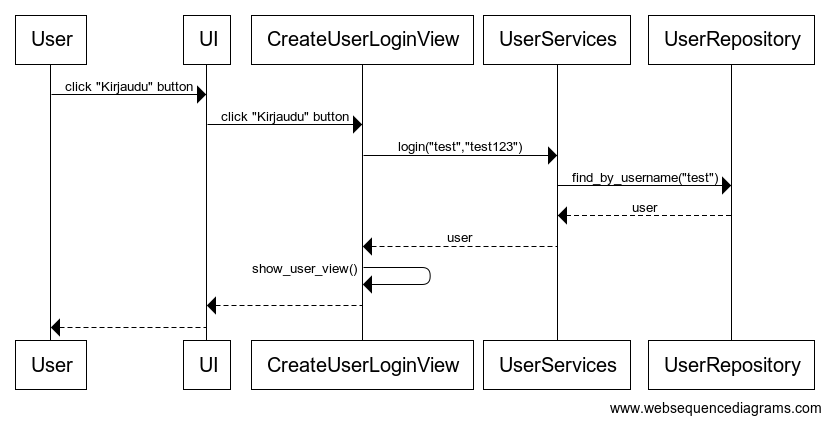
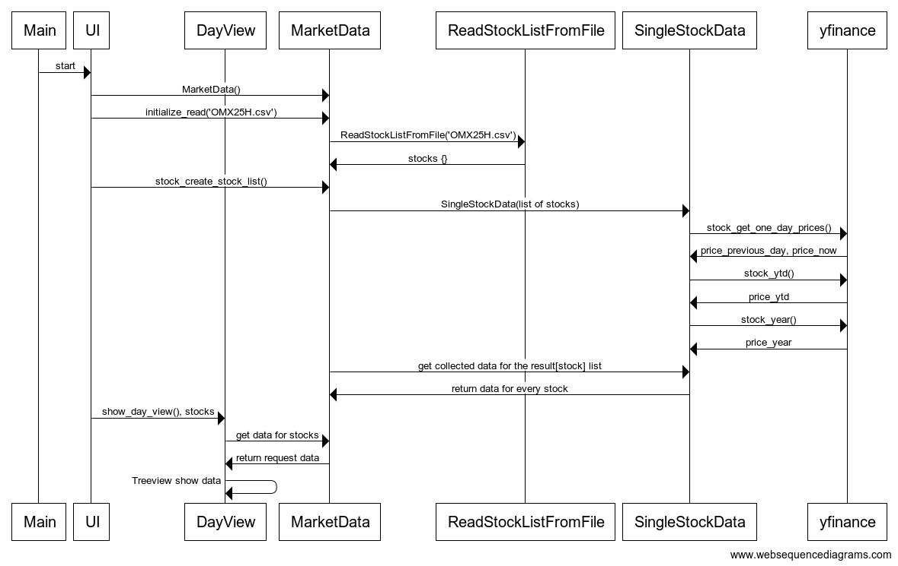
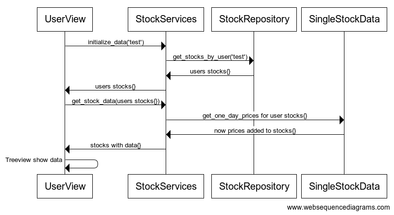

# Arkkitehtuurikuvaus

## Rakenne

Ohjelman rakenne on hyvin samankaltainen opintomariaalissa olevan referenssi soveluksen kanssa. Ohjelman rakenne noudattelee täten kolmitasoista kerrosarkkitehtuuria. Koodin pakkausrakenne on seuraava:



Koodi on jaoteltu paukkauksiin seuraavasti: _ui_ käyttöliittymä, _services_ sovelluslogiikka ja _repositories_ tietojen pysyväistallennus sekä sieltä lukeminen. Pakkaus _entities_ sisältää luokkia, jotka kuvastavat sovelukksen käyttämiä tietokohteita.

## Käyttöliittymä

Kättöliittymä sisältää käyttäjän näkökulmasta kolme erillistä näkymää:

- Päänäkymä osakekursseista
- Uuden käyttäjätunnuksen luominen/kirjautuminen
- Kirjautuneen käyttäjän näkymä

Jokainen näkymä on toteutettu omana luokkanaan. Päänäkymä muodostuu itse asiassa kolmesta eri luokasta. Näitä ovat [Päivä](../src/ui/day_view.py), [Vuoden alusta](../src/ui/ytd_view.py) sekä [Vuosi](../src/ui/year_view.py) -luokat. Näkymien vaihtaminen tapahtuu _button_ painikkeiden avulla. Näkymien näyttämisestä vastaa [UI](../src/ui/ui.py)-luokka. Kirjautumista varten aukeaa uusi näkymä, joka toteutetaan [Kirjaudu](../src/ui/create_user_login_view.py) -luokan avulla. Kirjautuneelle käyttäjälle aukeaa uusi näkymä [Omat osakkeet](../src/ui/user_view.py) -luokkaa käyttäen. Maksimissaan on näyvissä käyttäjälle kaksi näkymää yhtä aikaa.

Käyttöliittymä on pyritty eristämään täysin sovelluslogiikasta. Se ainostaan kutsuu _services_ pakkauksessa olevia luokkia ja metodeja.

## Sovelluslogiikka

Sovelluksen loogisen tietomallin muodostovat [MarketData](https://github.com/jarisokka/ot-harjoitustyo/blob/master/osakeseuranta/src/services/marketdata.py), [SingleStockData](https://github.com/jarisokka/ot-harjoitustyo/blob/master/osakeseuranta/src/services/singlestockdata.py) sekä [User](https://github.com/jarisokka/ot-harjoitustyo/blob/master/osakeseuranta/src/entities/user.py) luokat. Näistä vain `User` on puhdas olio. `MarketData` ja `SingleStockData` olioissa on myös palveluita mukana. Tämän takia jälkimmäiset luokat on sijoitettu _services_ pakkaukseen. `MarketData` on näistä olio, jonka tarpeellisuus on tässä vaiheessa vähäinen. Se vähentää tässä vaiheessa koodin toisteellisuutta ja ajatuksena on, että jos valittavana on useamman eri pörssin seuranta, niin tämän avulla niiden hallinnointi onnistuu.



Luokan `User` avulla määritellään omistussuhde tietokantaan tallennettuihin osakkeisiin.




## Tietojen pysyväistallennus ja lataus

Pakkauksen _repositories_ luokat `StockRepository` ja `UserRepository` huolehtivat tietojen tallentamisesta SQLite-tietokantaan.

Pakkauksen _repositories_ luokka `ReadStockListFromFile` vastaa CSV-tiedostojen avaamisesta ja lukemisesta. Näiden CSV-tiedostojen avulla voidaan hallita, mitä osakkeita sovelluksessa voidaan käyttää.

### Tiedostot

Käyttäjät tallennetaan SQLite-tietokannan tauluu `users` ja kirjautuneen käyttäjän osakkeet tauluun `stocks`. Tietokannat alustetaan [initialize_database.py](https://github.com/jarisokka/ot-harjoitustyo/blob/master/osakeseuranta/src/initialize_database.py) -tietostossa.

Soveluksessa käytettäviä osakkeita hallitaan CSV-tiedostojen avulla, jotka sijaitsevat _data_ kansiossa.

Tiedostojen formaatin tulee olla seuraavassa muodossa:
```
ticker;nimi
```
Sovelluksessa käytetään _yfinance_ kirjastoa, jonka avulla haetaan osakkeiden tiedot Yahoo Finance-palvelusta. Tämä haku tapahtuu _ticker_:eiden avulla ja tämän takia sen tulee olla täsmällinen. Osakkeen nimen voi määritellä haluamakseen, mutta tähän sovellukseen nyt laitetut nimet ovat yrityksien virallisia nimiä.

## Päätoiminnallisuudet

Seuraavassa käydään läpi sovelluksen toimintalogiikkaa muutaman päätoiminnallisuuden osalta sekvenssikaaviona.

### Uuden käyttäjän luominen

Jotta sovellukseen voi tallentaa omia osakkeita, tulee siihin ensin luoda käyttäjätunnus, jolla voidaan kirjautua sovellukseen. Päänäkymästä [UI](../src/ui/ui.py) päästään kirjautumis sivulle [Kirjaudu](../src/ui/create_user_login_view.py) klikkaamalla _Kirjaudu_ painiketta. Tältä sivulta voidaan luoda tunnus klikkaamalla _Luo tunnus_ painiketta.

Alla kuvattu sekvenssikaavio uuden käyttäjätunnuksen luomisesta. 



[Tapahtumankäsitettelijä](https://github.com/jarisokka/ot-harjoitustyo/blob/master/osakeseuranta/src/ui/create_user_login_view.py#L19) kutsuu sovelluslogiikan metodia [create_user](https://github.com/jarisokka/ot-harjoitustyo/blob/master/osakeseuranta/src/services/user_services.py) antaen parametriksi luotavan käyttäjän tiedot. Sovelluslogiikka selvittää `UserRepository`:n avulla, onko käyttäjätunnus jo olemassa. Jos ei, niin sovelluslogiikka luo uuden _User_-olion ja tallentaa sen kutsumalla `UserRepository`:n metodia `create`. Onnistuneen tunnuksen luonnin jälkeen käyttöliittymä avaa _messagebox_:n jossa informoidaan uuden tunnuksen luonnin onnistumisesta ja että käyttäjä voi nyt kirjautua sovellukseen.

### Käyttäjän kirjautuminen

Kirjautuminen tapahtuu [Kirjaudu](../src/ui/create_user_login_view.py) näkymästä, jonne päästään klikkaamalla päänäkymän _Kirjaudu_ painiketta. Kirjautuminen sovellukseen tapahtuu Kirjaudu näkymästä klikkaamalla _Kirjaudu_ painiketta.

Alla kuvattu sekvenssikaavio sovellukseen kirjautumisesta. 



[Tapahtumankäsitettelijä](https://github.com/jarisokka/ot-harjoitustyo/blob/master/osakeseuranta/src/ui/create_user_login_view.py) kutsuu sovelluslogiikan metodia [login](https://github.com/jarisokka/ot-harjoitustyo/blob/master/osakeseuranta/src/services/user_services.py) antaen parametriksi käyttäjätunnuksen ja salasanan. Sovelluslogiikka selvittää `UserRepository`:n avulla, onko käyttäjätunnus olemassa. Jos on, tarkastetaan täsmääkö salasana. Onnistuneen tarkastuksen jälkeen, käyttöliittymä avaa uuden näkymän `UserView`:n avulla. Tässä näkymässä käyttäjä voi hallinoida omien osakkeiden seurantaa. 

### Osakelistauksen muodostaminen DayView

Sovelluksen käynnistyessä sovelluksen kontrolli etenee seuraavasti:



Käyttöliittymä [UI](../src/ui/ui.py) luo uuden [MarketData](https://github.com/jarisokka/ot-harjoitustyo/blob/master/osakeseuranta/src/services/marketdata.py) olion ja kutsuu tämän metodia [initialize_read](https://github.com/jarisokka/ot-harjoitustyo/blob/master/osakeseuranta/src/services/marketdata.py#L23) antaen sille parametriksi tiedoston nimen, jota halutaan käyttää. `MarketData` lukee halutun tiedoston `Repository` luokan [ReadStockListFromFile](https://github.com/jarisokka/ot-harjoitustyo/blob/master/osakeseuranta/src/repositories/reader.py) avulla, joka palauttaa sille sanakirja muotoisen listauksen osakkeista. Käyttöliittymä `UI` kutsuu seuraavaksi `MarketData` luokan metotodia [stock_create_stock_list](https://github.com/jarisokka/ot-harjoitustyo/blob/master/osakeseuranta/src/services/marketdata.py#L38). `MarketData` luo aikaisemmin luetun osakelistauksen perusteella yksittäisiä osake olioita jokaisesta listalla olevasta osakkeesta käyttäen [SingleStockData](https://github.com/jarisokka/ot-harjoitustyo/blob/master/osakeseuranta/src/services/singlestockdata.py) luokkaa. `SingleStockData` luokka hakee tarvittavat tiedot [yfinance](https://github.com/jarisokka/ot-harjoitustyo/blob/master/osakeseuranta/src/services/singlestockdata.py#L31) kirjastoa käyttäen. `MarketData` kerää nämä tiedot [result](https://github.com/jarisokka/ot-harjoitustyo/blob/master/osakeseuranta/src/services/marketdata.py#L48) listaan. Data keräys on nyt valmis. Käyttöliittymä `UI` voi nyt käynistää oletusnäkymän [DayView](https://github.com/jarisokka/ot-harjoitustyo/blob/master/osakeseuranta/src/ui/day_view.py) anten sille _stocks_-listauksen osakkeista, joita halutaan näyttää. Käyttöliittymä `DayView` hakee tarvittavat tiedot osakkeista `MarketData` oliolta ja luo niistä listauksen _tkinterin_ _Treeview_ toiminnallisuutta hyödyntäen.

Sama toimintalogiikka toistuu myös käyttöliittymän [YTDView](https://github.com/jarisokka/ot-harjoitustyo/blob/master/osakeseuranta/src/ui/ytd_view.py) ja [YearView](https://github.com/jarisokka/ot-harjoitustyo/blob/master/osakeseuranta/src/ui/year_view.py) kohdalla.

### Osakelistauksen muodostaminen UserView

[Käyttäjäkohtaisen](https://github.com/jarisokka/ot-harjoitustyo/blob/master/osakeseuranta/src/ui/user_view.py) näkymän tietojen kontrolli etenee eri tavalla kuin edellisessä, koska tällöin käsitellään myös tietokantaa.



Käyttöliittymä `UserView` noutaa kirjautuneen käyttäjän osaketiedot kutsumalla luokan `StockServices` metodia [initialize_data](https://github.com/jarisokka/ot-harjoitustyo/blob/master/osakeseuranta/src/services/stock_services.py#L33) antamalla tälle parametriksi _käyttäjän_. `StockServices` hakee käyttäjän osakkeet `Repository` luokan [StockRepository](https://github.com/jarisokka/ot-harjoitustyo/blob/master/osakeseuranta/src/repositories/stock_repository.py) avulla, joka palauttaa listan käyttäjän osakkeista. Listaus sisältää osakkeen ticker-tunnuksen, nimen sekä myös käyttäjän sinne tallentamat ostohinnat ja ostoajankohdat. `UserView` käyttöliittymä päivittää tähän listaukseen näiden osakkeiden tämän hetkisen pörssikurssin sekä kehitysluvut euroina ja prosentteina. Tämä tapahtuu kutsumalla `StockServices` luokan metodia [get_stock_data](https://github.com/jarisokka/ot-harjoitustyo/blob/master/osakeseuranta/src/services/stock_services.py#L44) antamalla tälle parametriksi edellä mainittu listaus. `StockServices` luo tämän listauksen perusteella yksittäisiä osake olioita jokaisesta listalla olevasta osakkeesta käyttäen [SingleStockData](https://github.com/jarisokka/ot-harjoitustyo/blob/master/osakeseuranta/src/services/singlestockdata.py) luokkaa. Tässä kohtaa listaukseen päivitetään päivän osakekurssit ja kehitysluvut. Haku tapahtuu samalla tavalla kuin edellisessä _DayView_ tapauksessa. Listaus palautetaan `UserView` luokaan ja näytetään käyttäjälle _Treeview_ toiminnallisuutta hyödyntäen.


## Ohjelman rakenteeseen jääneet heikkoudet

### Ohjelman rakenne

Ohjelman rakenne ei ole täysin puhtaasti jaoteltu. Ohjelman rakennetta voisi vielä selkeyttää tekemällä osakkeista puhtaan olion, kuten käyttäjistä tehdään. Tällä hetkellä _marketdata.py_ ja _singlestockdata.py_ sisältää sekä palveluita että olio-rakennetta.

### Käytettävyys

Osakkeiden tietojen noutaminen osoittautui harmillisen hitaaksi kun hakuja suoritetaan useampia peräkkäin. Tästä syystä jouduin alkuperäistä ajatusta supistamaan. Tämän tyylinen sovellus toimisi paremmin nettipohjaisena, jossa palvelimella tapahtuisivat haut taustatoimintoina säännöllisesti ja näin viimeisimmät tiedot tulisivat käyttäjälle heti näkyviin.

### Käyttöliittymä

Graaffisesti käyttöliittymä on karu, joskin hoitaa sille annetut velvollisuudet. Koodissa on toistoa, etenki kohdissa, joissa käytetään tkinterin _Treeview_ toiminnallisuutta.

### Muuta

_yfinance_ kirjasto ja _poetry_ aiheuttivat harmia projektin alkuvaiheilla yhteensopivuus ongelmien johdosta. Saattaa olla, että _poetry_ asetuksiin on jäänyt jotain ylimääräistä sotkua tämän johdosta.

Jouduin myös jättämään kovakoodattua tietoa kohtaan jossa haetaan vuoden alusta olevaa pörssikurssia. Koska vuoden ensimmäinen pörssipäivä vaihtelee, niin hakua ei voi asettaa tiettyyn päivämäärään jokaiselle vuodelle. Tällöin haku saattaa tuottaa tyhjän haun ja tietoa ei saada noudettua. Tähän ongelmaan varmaan löytyisi jonkinlainen ratkaisu.

Konsoliin tulostuu automaattisesti tiedon haun onnistuminen _yfinance_ palvelusta. Ei tietoa, saako tätä ominaisuutta kytkettyä pois päältä.
