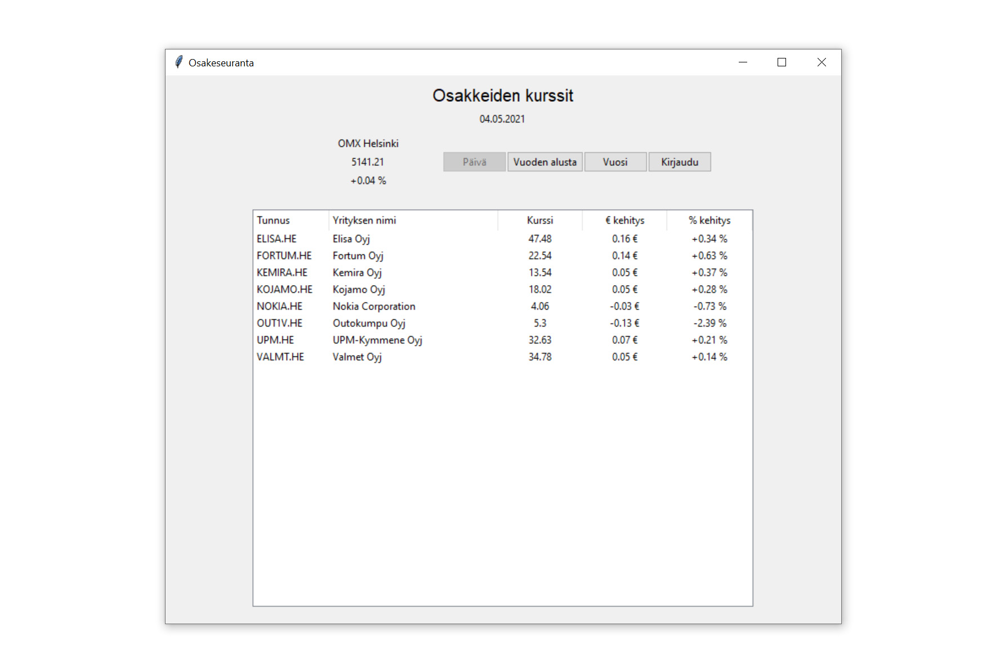
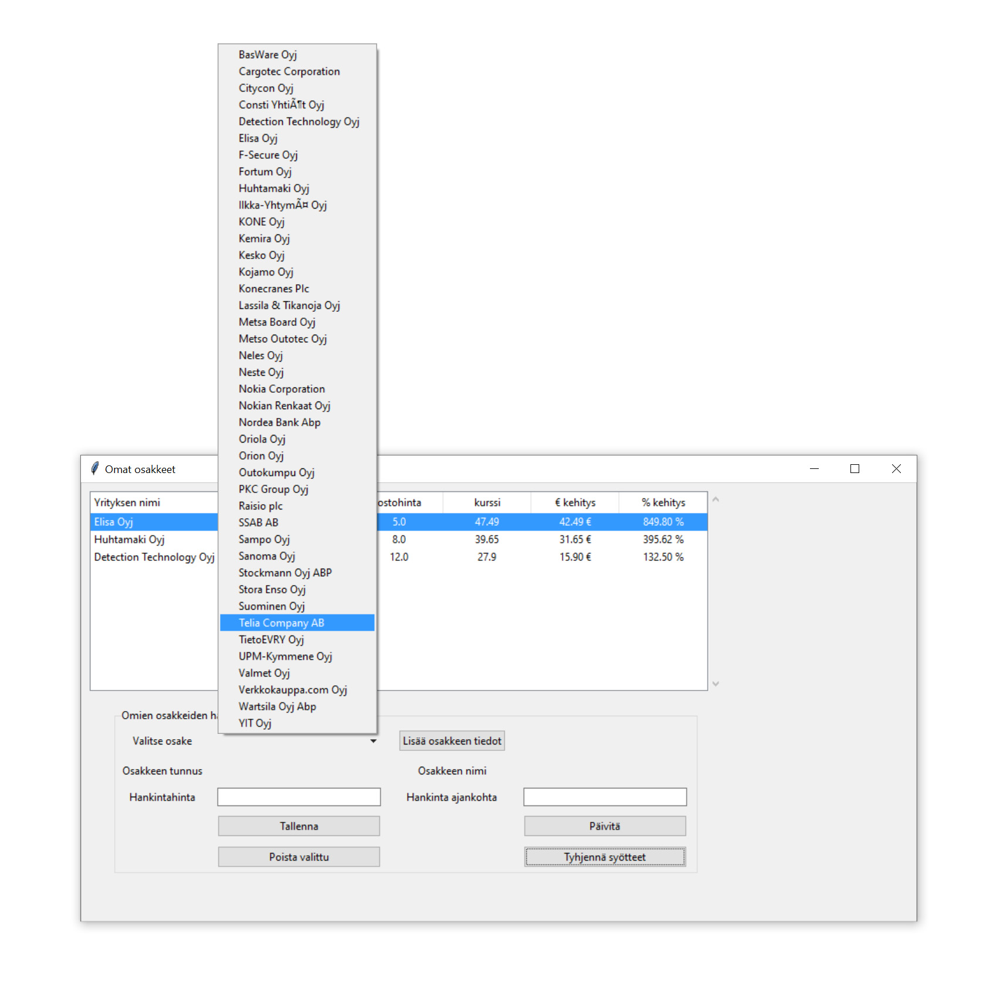
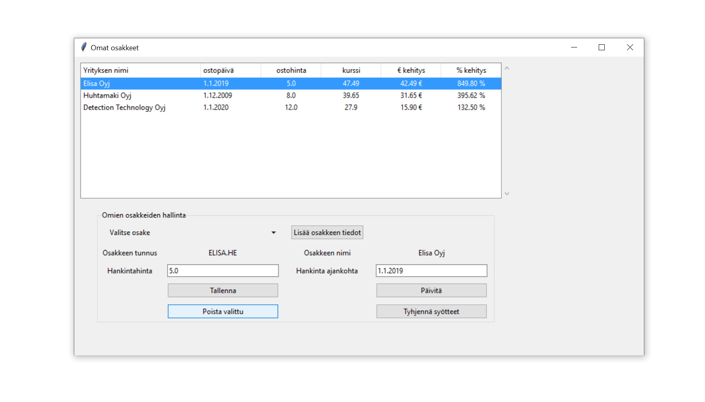

# Käyttöohje

Viimeisin [release](https://github.com/jarisokka/ot-harjoitustyo/releases/).  Saat ladattua lähdekoodin valitsemalla _Assets_-osion alta _Source code_.

## Konfigurointi

Omien osakkeiden tiedot tallenetaan _data_-hakemistoon. Tietokannan nimeä voi halutessaan kofiguroida käynnistyshakemiston _.env.-tiedostossa. Tiedoston muoto on seuraava:

```
DATABASE_FILENAME=database.sqlite
```

Soveluksessa käytettäviä osakkeita hallitaan CSV-tiedostojen avulla, jotka sijaitsevat _data_ kansiossa. Näitä tiedostoja on kaksi; OMX25H.csv jossa listaus osakkeista, jotka näytetään päänäkymässä sekä search_list.csv jossa listaus niistä osakkeista, joita kirjautunut käyttäjä voi lisätä omalle listalleen.

Tiedostojen formaatin tulee olla seuraavassa muodossa:
```
ticker;nimi
```

Näistä _ticker_-tunnus on kriittinen, koska sen avulla osakkeiden tiedot haetaan _yfinance_-kirjaston palvelusta. Tunnukset ovat samoja kuin mitä näytetään osakkeiden tiedoissa Yahoo Finance verokkosivulla.

## Ohjelman käynnistäminen

Ennen ohjelman käynnistämistä, suorita seuraavat komennot _osakeseuranta_-hakemistossa.

1. Asenna riippuvuudet komennolla:
```bash
poetry install
```

2. Suorita vaadittavat alustustoimenpiteet komennolla:
```bash
poetry run invoke build
```

```bash
poetry shell
```

Koska sovelluksessa käytettävä yfinance-kirjasto ei suostu asentumaan poetry:n avulla, asennetaan se erikseen.

```bash
pip3 install yfinance 
```

3. Käynnistä sovellus komennoilla:

```bash
poetry run invoke start
```

## Päänäkymä

Sovellus käynnistyy päänäkymään. Tämä voi kestää hetken, koska tässä vaiheessa noudetaan näkymän kaikkien osakkeiden kurssit. 

Oletusnäkymänä on tämän päivän kurssit sekä kehitykset edelliseen päivään. Voi vaihtaa näkymään kurssikehitykset vuoden alusta tai kehitys vuoden takaiseen tilanteeseen käyttämällä _Vuoden alusta_ ja _Vuosi_ painikkeita. 




## Uuden tunnuksen luonti ja kirjautuminen

Jotta käyttäjä voi tehdä listauksen omista osakkeistaan, pitää hänen luoda sovellukseen käyttäjätunnus. Tämä tapahtuu päänäkymästä painamalla _Kirjaudu_ painiketta. 


Avautuvaan ikkunaan syötetään käyttäjätunnus sekä salasana. Jos valitsemasi tunnus ei ole käytössä saat ilmoituksen, jossa kerrotaan käyttätunnuksen luonnin onnistuneen. Jos saat virheilmoituksen, että tunnus on jo olemassa, valitse jokin toinen käyttäjätunnus. Kirjaudu tämän jälkeen sovelluseen syöttämällä käyttäjätunnus ja salasana sekä painamalla _Kirjaudu_ painiketta.

## Omien osakkeiden hallinta

Voi seurata omien osakkeiden arvon kehitystä, lisäämällä haluamasi osakkeen omalle listalle. Osakkeelle tulee määritellä ostohinta sekä ostoajankohta. Jokaisella kirjautuneella käyttäjällä on näkyvissä vain omat sovellukseen tallennetut osakkeet.


### Osakkeen lisäsys listalle

Voit lisätä omia osakkeita seuraavasti. Valitse ensin _Valitse osake_ kohdasta nuolen avulla näkyviin alasvetovalikko, josta voit valita haluamasi osakkeen. Paina tämän jälkeen _Lisää osakkeen tiedot_ painiketta. Syötä tämän jälkeen osakkeelle _hankintahinta_ sekä _ostoajankohta_. Huomioitavaa on, että desimaalihinnat syötetään siten, että desimaalieroittimena käytetään pistettä. Paina tämän jälkeen _Tallenna_ painiketta. Saat ilmoituksen onnituneesta tietojen tallentamisesta ja osake näkyy nyt listauksessa.



### Osakkeen tietojen muuttaminen

Voit halutessasi muuttaa osakkeen tietoja seuraavasti. Valitse yleisnäkymän listalta osake, jonka tietoja haluat muuttaa. Osakkeen tiedot täydentyvät hankintahinta ja hankinta ajanjohta kohtiin. Tee tämän jälkeen haluamasi muutoset ja paina _Päivitä_ painiketta. Saat vahvistuksen onnituneesta tietojen muutoksesta ja osakkeen tiedot päivittyvät listaukseen.


### Osakkeen poisto

Voit halutessasi poistaa osakkeen listauksesta seuraavasti. Valitse yleisnäkymän listalta osake, jonka haluat poistaa. Paina tämän jälkeen _Poista_ painiketta. Saat vahvistuksen onnituneesta poistosta ja kyseinen osake poistuu näkymästä.

