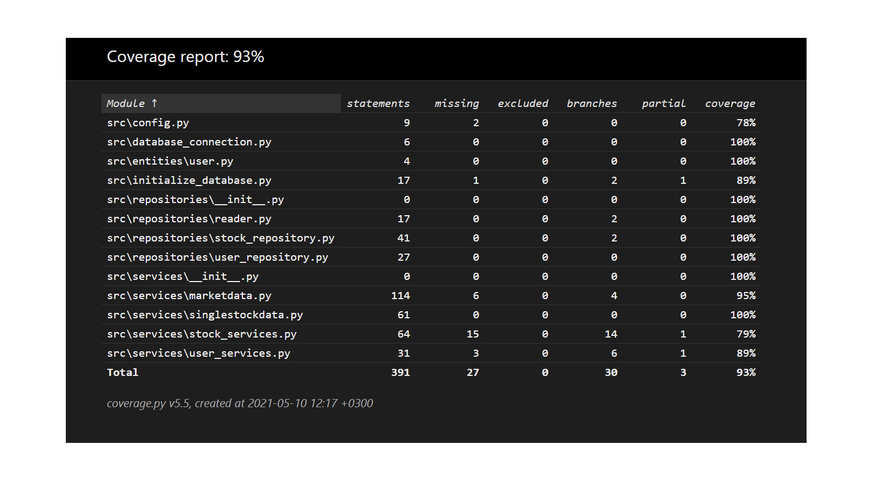

# Testausdokumentti

Ohjelmaa on testattu sekä automatisoiduin yksikkö- ja integraatiotestein unittestilla sekä manuaalisesti tapahtunein järjestelmätason testein.

## Yksikkö- ja integraatiotestaus

### Sovelluslogiikka

Jokaista sovelluslogiikasta vastaavaa luokkaa `MarketData`, `SingleStockData`, `StockServices` ja `UserServices` testataan omalla testiluokallaan. `MarketData`:n testauksessa käytetään testausta varten omaa lyhyempää listausta osakkeista. Listaus sijaitsee _data_ kansiossa nimellä OMX25H_test.csv. `SingleStockData` testataan käyttämällä _Nordean_ osakkeen tietoja. `StockServices`:n testauksessa hyväksikäytetään `FakeDatabase`-luokkaa, jolla luodaan oma vain testaukseen käytettävää tietokanta _test-database.sqlite_.  `UserServices`-luokka testataan samaisella testitietokannalla.

### Repositorio-luokat

Repositorio-luokkia `StockRepository` ja `UserRepository` testataan ainoastaan testeissä käytössä olevalla tietokannalla. Molemmat luokat testataan samma tekniikalla, antamalle niille ennalta määritellyt arvot, jotka tallentetaan testitietokantaan.

### Testauskattavuus

Käyttöliittymäkerrosta lukuunottamatta sovelluksen testauksen haarautumakattavuus on 93%

## Järjestelmätestaus

Sovelluksen järjestelmätestaus on suoritettu manuaalisesti.

### Asennus ja konfigurointi

Sovellusta on testattu [käyttöohjeen](./kayttoohje.md) kuvaamalla tavalla sekä Windows- että Linux-ympäristössä.

Sovellusta on testattu sekä tilanteissa, joissa käyttäjät ja osakkeet tallettavat tietokannat ovat olleet olemassa ja joissa niitä ei ole ollut jolloin ohjelma on luonut ne itse.

### Toiminnallisuudet

Kaikki [määrittelydokumentin](./vaatimusmaarittely.md) ja käyttöohjeen listaamat toiminnallisuudet on käyty läpi. Kaikkien toiminnallisuuksien yhteydessä on syötekentät yritetty täyttää myös virheellisillä arvoilla kuten tyhjillä.

## Sovellukseen jääneet laatuongelmat

Sovellus ei anna tällä hetkellä järkeviä virheilmoituksia, seuraavissa tilanteissa:

- Osakkeiden hallinnointiin käytettävä csv-tiedosto puuttuu.
- Omien osakkeiden tallenuksessa käytettävää hakulistausta (search_list.csv) ei testattu jokaisen osakkeen osalta, joten se voi sisältää virheellisiä osakkeita.
- Käytössä ei ole internet yhteyttä ja tämän johdosta ei voida käyttää _yfinance_ kirjastoa.
- SQLite tietokantaa ei ole alustettu, eli `python -m poetry run invoke build`-komentoa ei ole suoritettu
